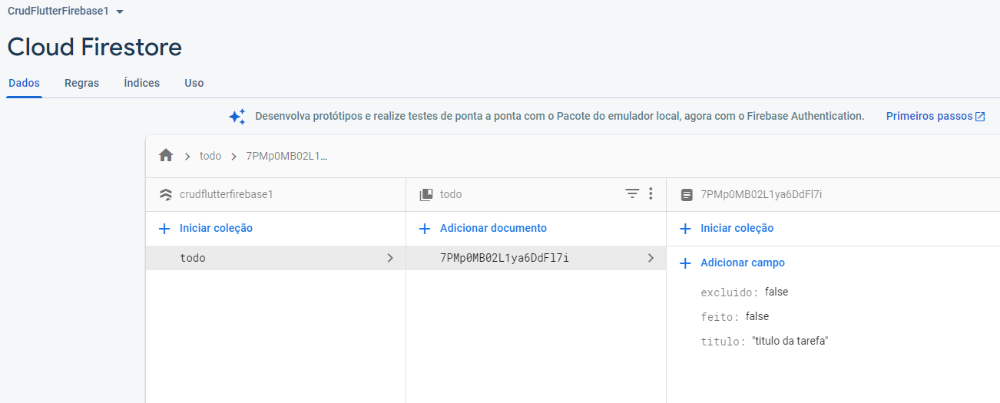
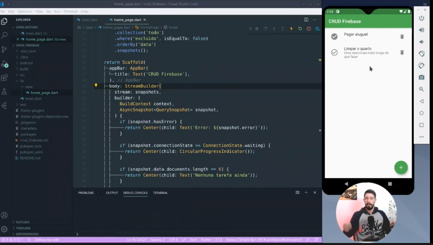

# Flutter-CRUD-Firebase1
Seguindo instruções dos artigos:  

  https://petercoding.com/firebase/2020/04/04/using-cloud-firestore-in-flutter/

## Tutorial Youtub:    

Flutter-CRUD-Firebase1  - https://www.youtube.com/playlist?list=PLL9T96XhR2deGksOFkyJ8hGy5rh7LLgUm

  

